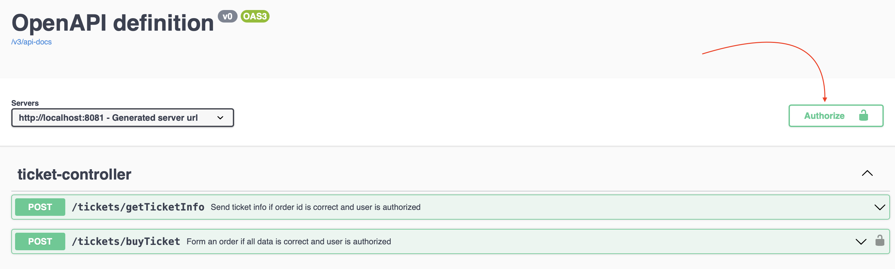
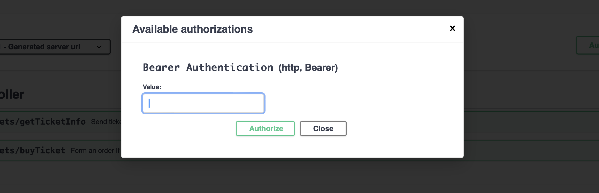
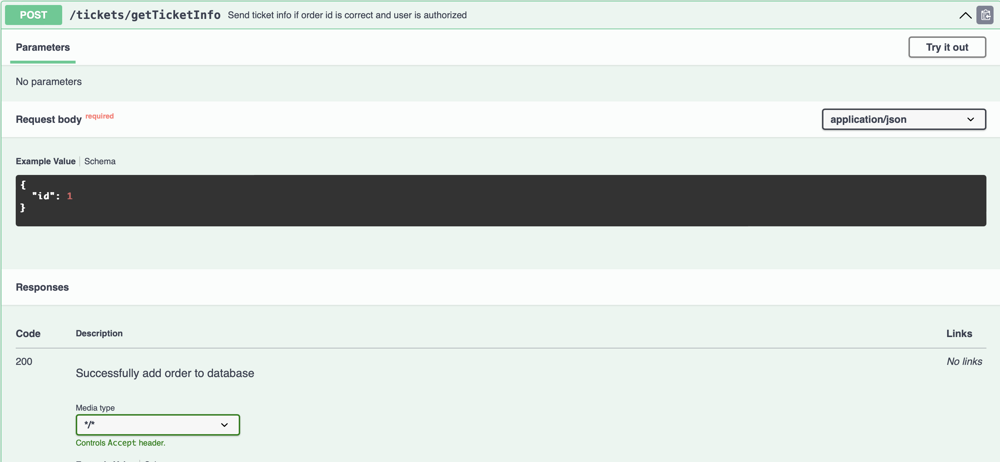
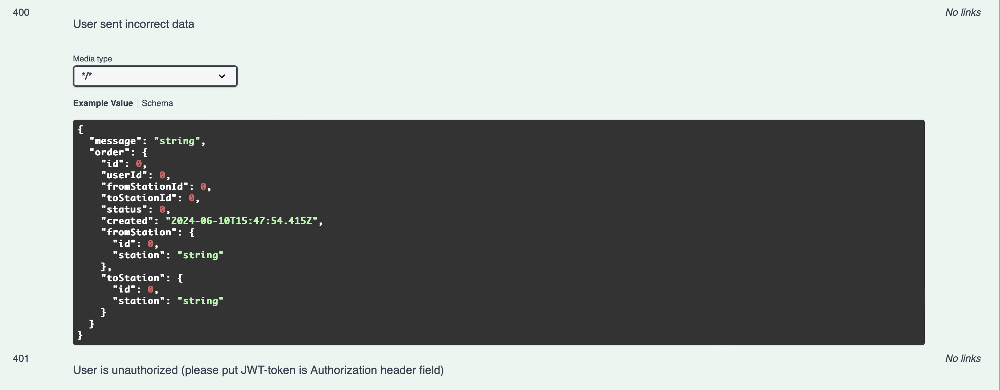

# Система управления заказами на основании микросервисной архитектуры
> Тямин Илья БПИ-226

## Что предоставлено?
Два микросервиса, работающие с разными базами данных. Для корректного запуска на любом устройстве, имеющиеся сервисы были контейнеризованы с помощью Docker (в папке auth-service есть свой [докерфайл](auth-service/Dockerfile), у сервиса с заказами есть свой [докерфайл](ticket-service/Dockerfile), все объединено вместе с помощью [докер-компоуза](docker-compose.yml)).

Есть два микросервиса:
> Здесь кратко указана спецификация API. Я также поднял Swagger, там все указано подробно, с кодами ошибок и т.д, а также предоставил примерные варианты, как может выглядеть поле. О Swagger ниже напишу
- Управляющий авторизацией пользователя и отвечающий за обработку и распостранение токенов - это auth-service. Он имеет 3 эндпоинта:
    - `/auth/register` для регистрации пользователя. Пользователь предоставляет на вход сервису никнейм, почту и пароль. Пароль должен удолетворять следующим требованиям: длиной больше или равен 8, содержать заглавные и маленькие латинские буквы, цифры и спецсимволы (!"№%:,.;). 
    - `auth/login` для авторизации пользователя. Пользователь предоставляет почту и пароль, сервис проверяет его наличие (был ли зарегистрирован пользователь) и, в случае успеха, отправляет ему токен на вход. **Важно!** Пользователю нужно будет запомнить этот токен для дальнейших действий.
        - Длина сессии пользователя - 1 час. После этого ему будет необходимо еще раз авторизоваться.
        - Если сессия пользователя действительна, но он еще раз авторизуется, его сессия продлевается с новым токеном, старый токен становится недействительным.
        - В БД все хранится в зашифрованном виде
    - `auth/getInfo` для предоставления данных о пользователе через токен. На вход принимает токен, на выход информацию о пользователе (действителен ли токен, ID, nickname)
- Управляющий созданием заказов (билетов) микросервис - `ticket-service`. Он имеет 2 эндпоинта:
    - `tickets/buyTicket` для создания билета с характеристиками, указанными в body запроса. **Важное условие - пользователь должен быть авторизован в микросервисе с аутентификацией на момент запроса и его токен должен быть действителен**. Токен, полученный из микросервиса 1, надо передать в хедере "Authorization"(если используем Postman, то нужно выбрать "Bearer Token", иначе нужно указать "Bearer: {your_token}"). Принимает в body ID станции отправления и ID станции прибытия, проверяет, что если они есть в БД (**что есть в БД написано ниже**), тогда сохраняет в БД, иначе возвращает ответ, что таких станцией не существует. Возвращает пользователю ID заказа.
    - `tickets/getTicketInfo` для проверки статуса и получения информации о заказе по его ID. **Работает также для авторизованных пользователей и токен также необходимо передать по правилам, описанным выше**. Принимает в body ID заказа. Если такого ID нет, то возвращает ошибку.

### Swagger
Для получения полной спецификации API, можно воспользоваться поднятым мною сервисом Swagger. Там указана информация о всех endpoint-ах, кодах HTTP, которые могут быть получены. Также указаны "схемы" запросов и "схемы" ответов: то, какими могут быть поля, каким правилам они должны соответствовать и многое другое. 

Для микросервиса-1 (auth) при поднятии через указанный docker-compose:
> [http://localhost:8080/swagger-ui/index.html#/](http://localhost:8080/swagger-ui/index.html#/)

Для микросервиса-2 (ticket) при поднятии через указанный docker-compose:
> [http://localhost:8081/swagger-ui/index.html#/](hhttp://localhost:8081/swagger-ui/index.html#/)

Работая напрямую со Swagger, может понадобиться возможность указать токен для корректной работы второго микросервиса (при отправке запросов).


В таком случае, будет автоматически развернуто окно для указание токена:


В общем виде, информацию об endpoint-е выглядит так:



ТЬам же можно если что протестировать)

### Docker: как запустить?
Итого запускается 4 образа:
- auth-service
- база данных для auth-service
- ticket-service
- база данных для ticket-service

Для запуска, было бы хорошо иметь `postgres` образ для Docker (или он скачается сам, но нужно включить VPN). Для запуска всех микросервисов сразу нужно в терминале, находясь в папке проекта на одном уровне с docker-compose.yml, написать:
```
docker-compose up
```

### Пару слов о Spring Secutriy
Во втором микросервисе я использую Spring Security, а точнее свой написанный фильтр (если в коде, то он называется `JWTFilter`).

Что он делает:
1. Смотрит, был ли передан в хедере Authorization токен. Если да, то выделяет его 
2. Кидает с помощью WebFlux запрос на первый микросервис на endpoint `auth/getInfo`, посылая полученный токен. В ответ он либо разрешает доступ, если токен НЕ просрочен и вообще такой токен существует (переходит к следующему фильтру в цепочке фильтров Spring Security) или отдает `401 Unauthorized`, если токен неверный / токена нет / токен просрочен.

### Миграции 
Для того чтобы предоставить сразу возможность тестирования системы, во второй микросервис было добавлено автоматическое заполнение БД станциями при заполнении.

На момент создания БД, таблица с станциями будет иметь 1117 записей с различными городами России. Таблица заполняется городами, взятыми из [текстового файла](https://gist.githubusercontent.com/helart/96225136a784f8a3987398be96456dce/raw/8d4b63baf056ca0680c6fc18fc76f17c83525c28/txt-cities-russia.txt) - делается GET запрос на сервер гитхаба и берутся города из текстового файла.

Таким образом, валидными ID для создания заказов будет являться числа от 1 до 1117. Это ID, означающие города, которые есть в БД.

На момент создания БД, таблица с пользователями является пустой. 

### Эмулятор обработки
[UPD 10.06 22:40]

Также был добавлен эмулятор обработки заказов: каждые 10 секунд он выбирает случайный необработанный заказ (со статусом 1) и меняет его или на статус 2, или на статус 3 (также случайно). Эмулятор реализован в отдельном потоке, что позволяет программе принимать запрос по эндпоинту и работать потоку одновременно. Его реализацию можно увидеть в ProcessService

## Что было использовано?
Оба микросервиса написаны на Spring с использованием Spring Boot, Spring Data и Spring Security. В частности, используется Hibernate для ORM (отображение ООП в БД), PostgreSQL для создания БД, Spring WebFlux для того чтобы посылать запросы от 2-го микросервиса к 1-му, Docker для контейнеризации.


## Спасибо за прочтение :)
